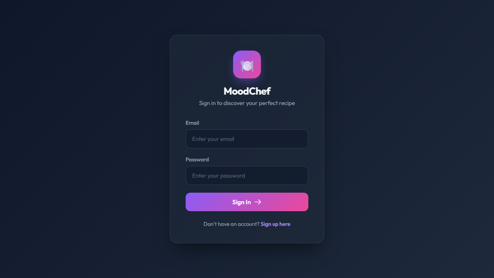
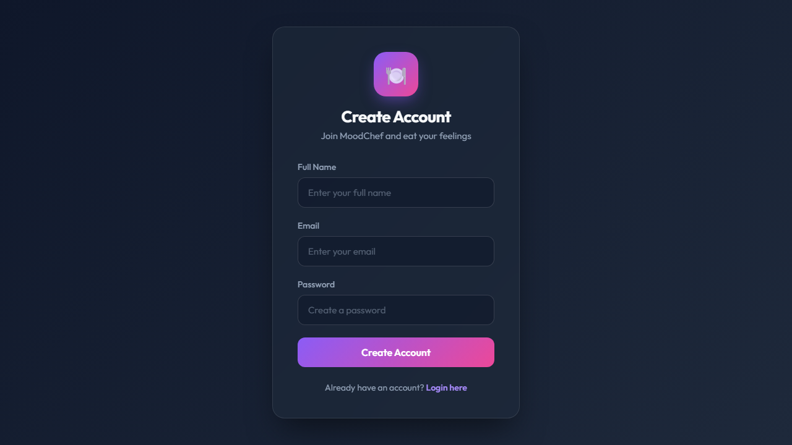
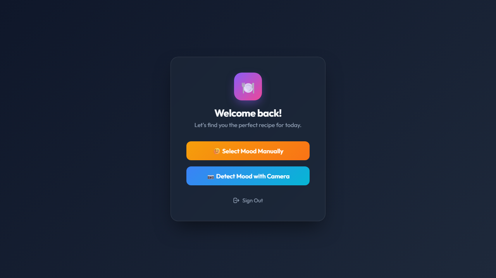
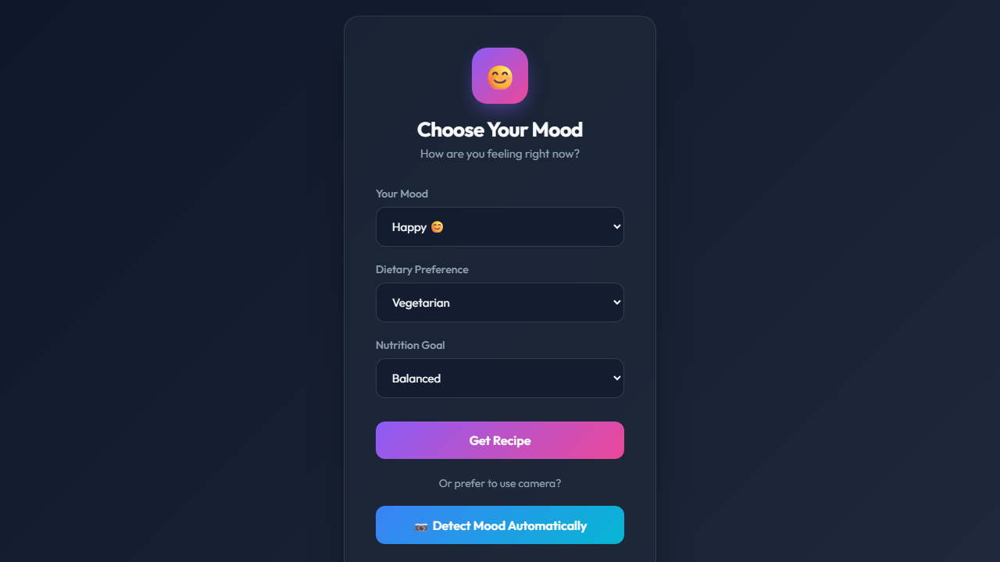
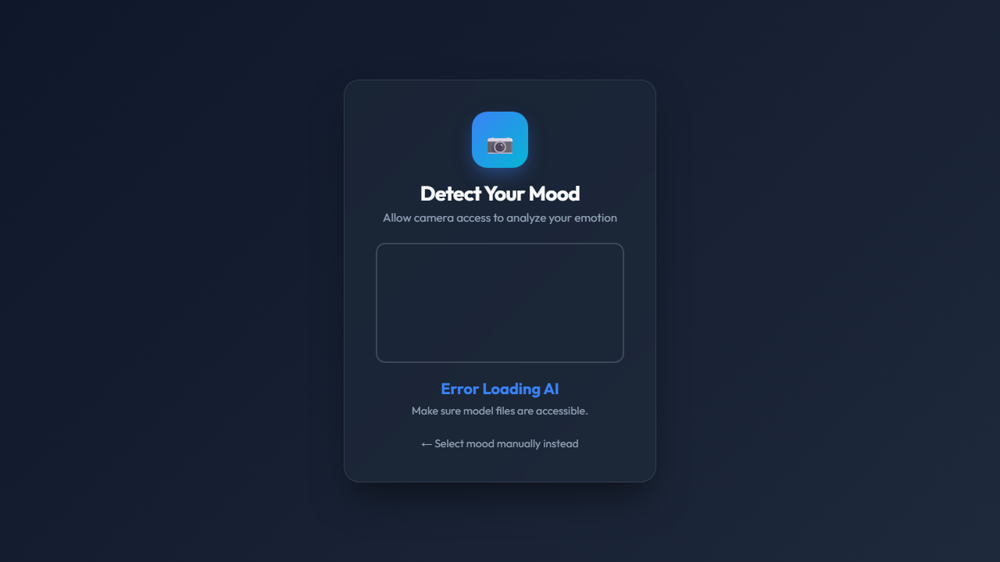
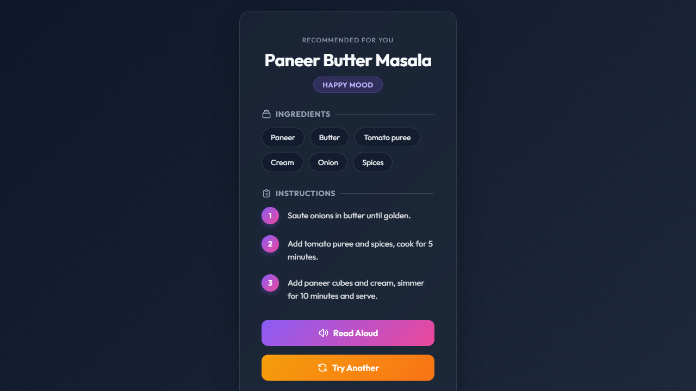

# MoodChef 🍽️🎭

MoodChef is an intelligent, mood-based recipe recommendation web application. It understands your current emotional state and dietary preferences, and serves up the perfect recipe to match how you're feeling! 

Whether you're feeling happy, stressed, sad, or energetic, MoodChef finds the perfect meal to complement or comfort your mood.

## Features ✨
- **User Authentication**: Secure Login and Signup functionality.
- **Mood Selection**: Let the app know how you're feeling and your dietary preference (Vegetarian, Non-Vegetarian, etc.).
- **Smart Recommendations**: Get a curated recipe tailored to your exact mood.
- **Beautiful UI**: Modern, clean, and responsive design with smooth animations.
- **Recipe Details**: View comprehensive recipe information directly in the browser.

## Screenshots 📸

### 1. Login Page


### 2. Signup Page


### 3. Home Page


### 4. Mood Selection


### 5. AI Detection (Coming Soon/Optional)


### 6. Recipe Recommendation Result


## Tech Stack 🛠️
- **Backend**: Python, Flask
- **Database**: SQLite
- **Frontend**: HTML5, CSS3 (Modern Vanilla CSS), JavaScript
- **Data**: JSON based recipe storage

## How to Run Locally 🚀

1. **Clone the repository:**
   ```bash
   git clone https://github.com/hemshah415/MoodChef.git
   cd MoodChef
   ```

2. **Install requirements:**
   Ensure you have Python installed. You may also need `flask`.
   ```bash
   pip install flask
   ```

3. **Run the Application:**
   ```bash
   python app.py
   ```

4. **Open in Browser:**
   Navigate to `http://127.0.0.1:5000` to start using MoodChef!

## Contributing 🤝
Pull requests are welcome. For major changes, please open an issue first to discuss what you would like to change.

## License 📝
[MIT](https://choosealicense.com/licenses/mit/)
